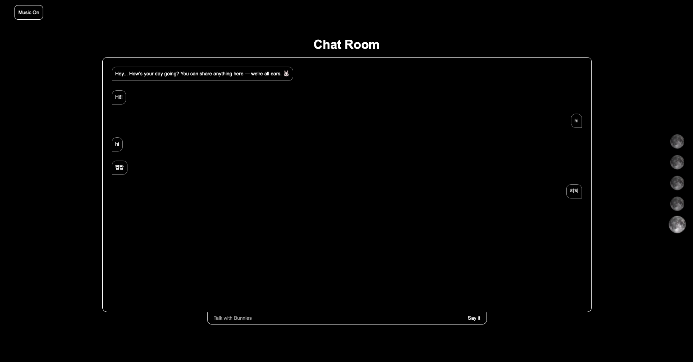

# 🌙 To the Moon

[](https://to-the-moon-ashen.vercel.app)


달에 관한 정보를 시각적으로 확인할 수 있는 웹사이트입니다.  
Canvas를 활용한 3D 모델링과 다양한 CSS 애니메이션을 적용하여 생동감 있는 사용자 경험을 제공합니다.

## 📆 프로젝트 기간
- **초기 개발:** 2020.6 - 2020.7 (React.js 기반)
- **업그레이드:** 2025.2 - 2025.2 (Next.js로 변경)

## 👨‍💻 역할
- 1인 개발 (Full-Stack Development)

## 🛠️ 사용 기술
- **Frontend**: React.js → Next.js (2025년 변경)
- **Backend**: Node.js, Express.js
- **Database**: MongoDB
- **3D 모델링**: Canvas API, Three.js
- **CSS 애니메이션**: keyframes, transform 등 활용

## 🚀 섹션별 설명
- **인트로**:CSS transform과 transition기능을 이용한 애니메이션으로 달이 떠오르도록 하여 시각적 재미를 더했습니다. 또한 왼쪽 상단의 music on/off기능으로 드뷔시의 달빛을 즐길 수 있습니다.


- **달 지형 정보**: SF영화의 우주선 계기판에서 영감을 받아 물체의 정보를 표시하는 애니메이션을 설정하였습니다.


- **CSS 카드 애니메이션**: Mouse hover 했을 시에 카드가 뒤집히며 달의 뒷면을 볼 수 있도록 하였습니다. z-index를 통해 카드임에도 3D로 보이도록 하였습니다. 달의 뒷면을 볼 때에는 귀여운 지구가 작게 보이도록 하여 실제로 달의 뒷면에서 바라본 풍경을 고증하였습니다. (궁금하도록 이미지 첨부는 하지 않았으니 위의 링크를 통해 직접 확인해보세요)


- **3D 모델**: Three.js를 통해 Nasa에서 받아온 달의 3D 모델을 사용자가 직접 움직이며 확인할 수 있습니다. 시간에 따라 조금씩 움직이도록 하여 생동감을 더했습니다.


- **실시간 채팅**: 이전에는 React 버전에서 WebSocket, Express, MongoDB를 활용하여 실시간 채팅 기능을 구현하였습니다. 하지만 서버리스인 Next.js와 실시간 연결인 WebSocket은 구조적으로 맞지 않고, 직접적으로 사용할 수 있는 방법도 없습니다. 우회적으로 구현하는 방법은 WebSocket용 서버를 따로 사용하는 것이지만, 이러면 Next.js를 사용하는 의미가 희석됩니다. 이러한 문제를 해결하기 위해서는 서드파티 서비스를 이용하는것이 좋다고 생각합니다. 저는 실시간 채팅 부분을 클라이언트에서 렌더링 하고,  Firebase의 database와 통신하게 하여 문제를 해결하였습다. 이렇게 하면 Next.js의 서버사이드 렌더링의 장점을 활용하면서 실시간 채팅 기능을 구현할 수 있습니다.



## 📌 설치 및 실행 방법
```sh
# 1. 프로젝트 클론
git clone https://github.com/moonjiuk/to-the-moon.git
cd to-the-moon

# 2. 패키지 설치
npm install

# 3. 개발 서버 실행
npm run dev

